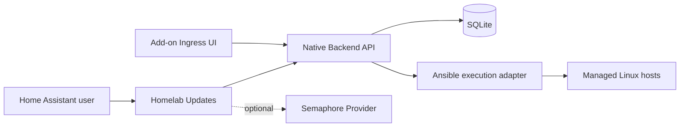
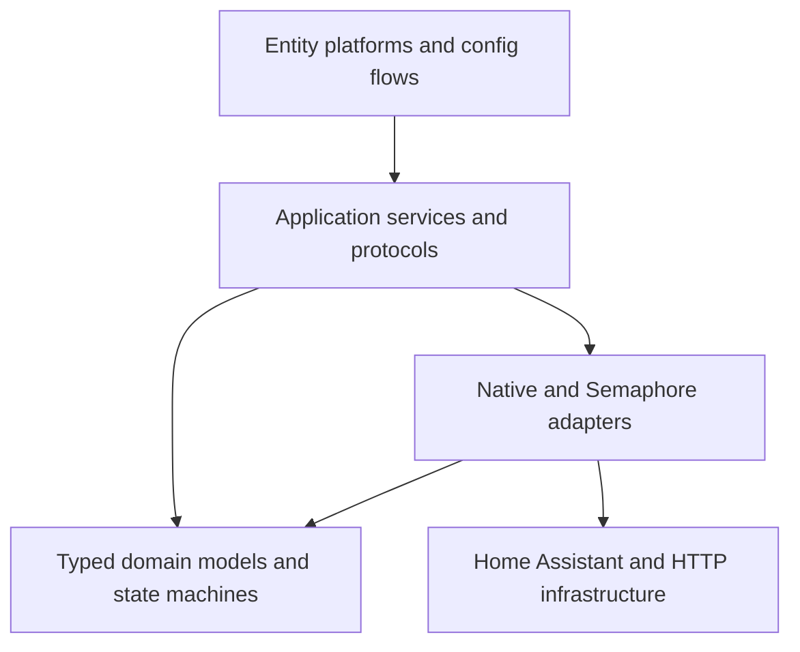

# Architektur

## Kontext

Home Assistant besitzt weder Inventar noch Hostzugangsdaten. Das native Backend
ist dieselbe Anwendung im Add-on und Standalone-Container. Es liefert
normalisierten Status und nimmt absichtliche Commands an. Semaphore bleibt ein
alternativer Legacy-Provider.

## Schichten

### Presentation

Config Flow, Coordinator-gebundene Entities, DeviceInfo, Übersetzungen und
Diagnostics. Diese Module übersetzen zwischen Home-Assistant-Konzepten und
Application Services, enthalten aber keine Backend-Payloadlogik.

### Application

Orchestriert Use Cases wie `refresh_hosts`, `start_host_update`, `reboot_host`,
`check_all` und `refresh_export`. Protocols beschreiben benötigte Fähigkeiten.
Task-Tracking sitzt hier oder in einem klar begrenzten Task Manager.

### Domain

Immutable, typisierte Modelle für Hoststatus, Task, Taskzustand und Capabilities.
Parsing findet an Adaptergrenzen statt. Modelle enthalten keine Home-Assistant-
oder aiohttp-Typen.

### Adapters

`NativeBackendClient` kennt die versionierte native REST-API.
`HttpStatusProvider` und `SemaphoreBackend` kapseln das Legacy-Modell mit
getrenntem Status-Export. Alle implementieren dieselben Provider-Protocols oder
deklarieren optionale Capabilities.

### Native Backend

Der Backend-Kern trennt API, Application Services, Domainmodelle, Persistenz und
Execution Adapter. SQLite speichert Hosts, Jobs und Custom Tasks. Ein begrenzter
Worker nimmt Jobs aus der persistenten Queue; mutierende Aktionen werden pro
Host serialisiert. SSH- und Ansible-Details gelangen nicht in API-Domainmodelle.

Der Ansible Adapter erzeugt pro Lauf ein isoliertes Ein-Host-Inventory. Alle
Module verwenden `auto_silent` für dieselbe automatische Interpreter-Erkennung.
Ein projektinterner stdout-Callback kapselt genau ein Modulevent als JSON;
Warnungen und technische Ausgabe bleiben getrennt im begrenzten Joblog. Der
Adapter akzeptiert Daten nur bei Prozess-Exit `0`, Taskstatus `ok` und gültigem
Envelope. Das ersetzt das frühere Parsen des menschenlesbaren Ad-hoc-Formats.

Das additive API-Jobmodell normalisiert Hostname, Typ, Zustand, Zeitstempel,
Exit-Code, sicheren Kurzfehler, Dauer und Logverfügbarkeit. Home Assistant hält
davon ausschließlich kompakte Metadaten im Coordinator: der neueste Job und der
neueste fehlgeschlagene Job werden unabhängig ausgewählt. Ein späterer Erfolg
überschreibt deshalb den aktuellen Job, aber nicht den historischen Fehler.

Der Debian-Provider beschreibt Paketmanageroperationen, nicht deren Transport.
`check_updates` orchestriert Facts, idempotenten APT-Cache-Refresh, locale-stabile
Paketliste und Reboot-Dateistatus als einzeln klassifizierte Phasen. Weitere
Provider können dieselbe Grenze nutzen, ohne API, Queue oder Entities zu ändern.

### Add-on

Das Add-on verpackt exakt denselben Backend-Kern. Es ergänzt Startskript,
Optionsübersetzung und eine Ingress-Weboberfläche, erhält aber weder
Docker-Socket noch Host-Netzwerk. Persistente Daten liegen unter `/data`.

### Management UI Auth und Livezustand

Die External API bleibt Bearer-authentifiziert. Standalone tauscht den Token an
einem dedizierten Login-Endpunkt gegen eine kurzlebige, prozesslokale opaque
Session im HttpOnly Cookie. Ingress nutzt stattdessen ausschließlich Supervisor
als Authentifizierungsgrenze. Mutationen beider UI-Modi benötigen CSRF.

Ein zentraler Dashboard-Refresh lädt die vollständige Ansicht. Nur während
`queued`/`running` existiert, lädt ein einzelner UI-Poller gezielt Jobs und Hosts
nach. Terminalzustände stoppen ihn; Fehler verlängern das Intervall. Spätere
Push-Transporte können diese Presentation-Grenze ersetzen, ohne Queue oder API-
Domainmodelle zu ändern. Siehe [[adr/0006-standalone-ui-session]].

Jobbuttons navigieren ausschließlich über einen lokalen Hash nach
`#/jobs/<job-id>`. Der Hash bewahrt beliebige Ingress-Prefixe und wird nicht an
den Server übertragen. Metadaten und redigierter Log kommen weiterhin aus
authentifizierten `/ui-api`-Routen. Standalone behält den Hash im Loginzustand und
öffnet ihn nach erfolgreicher Sessionerzeugung; weder Token noch Session-ID
werden Bestandteil des Links.

## Vorgesehene Laufzeitobjekte

Ein typisiertes `ConfigEntry.runtime_data` enthält mindestens Coordinator,
Application Service, Adapter und Lifecycle/Task Manager. Es gibt kein paralleles
globales `hass.data`-Registry-Modell.

## Datenfluss: Status

1. Coordinator fordert einen Snapshot vom Status Provider an.
2. Adapter validiert JSON und erzeugt `Mapping[HostId, HostStatus]`.
3. Coordinator ersetzt den Snapshot atomar oder meldet `UpdateFailed`.
4. Entities lesen ausschließlich den Coordinator-Snapshot.
5. Plattformlistener ergänzen Entities für neu erkannte IDs.

## Datenfluss: Command

1. Nutzer löst eine Home-Assistant-Aktion aus.
2. Entity ruft einen Application Use Case mit technischer Host-ID auf.
3. Automation Adapter startet den konfigurierten Task.
4. Task Manager verfolgt den Zustand asynchron mit Timeout und Cancellation.
5. Nach Erfolg fordert die Application einen Statusrefresh an.
6. Meldet der neue Snapshot Neustartbedarf, synchronisiert ein Coordinator-
   Listener einen behebbaren Repair-Hinweis.
7. Der Repair-Flow validiert den aktuellen Snapshot erneut und startet den
   Reboot-Command ausschließlich nach Nutzerbestätigung.
8. Bei Fehler wird eine übersetzbare Home-Assistant-Exception erzeugt.

## Failure Domains

Status Provider und Automation Backend besitzen getrennte Gesundheitszustände.
Ein Fehler des einen darf den anderen nicht unnötig unavailable machen. Fehler
werden an der Grenze in sichere projektspezifische Exceptions übersetzt.

## Erweiterungspunkte

- neue `HostProvider`-Implementierung
- neues `AutomationBackend`
- optionale Backend-Capabilities
- neue, thematisch begrenzte Entity-Plattform oder Application Services
- neues Payloadschema mit expliziter Version/Migration

Nicht vorgesehen ist ein universelles Plugin-System innerhalb der Integration.
Python-Protokolle und saubere Adaptergrenzen sind zunächst einfacher testbar und
ausreichend flexibel.

Siehe [[adr/0001-ports-and-adapters]], [[adr/0002-public-by-default]],
[[adr/0004-safe-reboot-flow]] und [[adr/0005-native-backend-boundary]].
